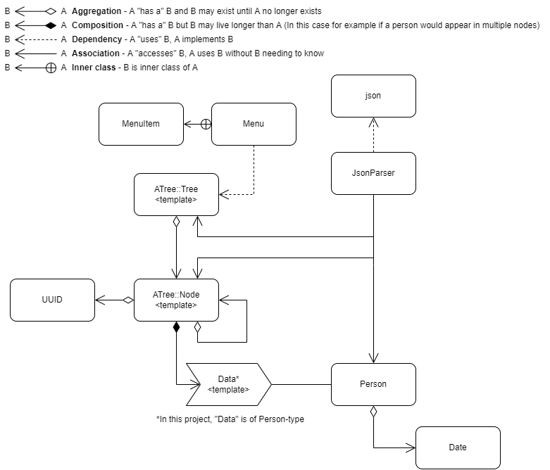

# Ancestor tree

#### Portfolio assessment AIS1002 - Ancester tree
This is the final project by two students taking part of the subject "Object-oriented programming and algorithms" on NTNU Ålesund during spring 2022

|  |  |  
|--|--|  
| Group Number | **11** |    
| Candidate Numbers     | **10014**,  **10016**|  
| Institution Number | **194** |  
| Subject | **Object-oriented programming and algorithms** |  
| Subject Code | **AIS1002** |


--- This tool to allows a user to generate an ancestor diagram. You can either use the example console application to build  a tree, or use the library to build your own application. The tree is template based, which means you are not forced to  create an ancestor tree of people. Maybe you want to track organize the ancestors of your dog? You can either build up  from scratch or load an existing tree stored in a .JSON-file. <br>

## Limitations
* This tree only allows for two parents, this is by purpose and as of given terms in the assignment
* The tree can save to file but as for now, json is the supported format. Feel free to contribute by making support for other file-types
* The date-class is a very simple one and has some major limitations. It does not handle leap year, which reduces possibilities like calculating days between dates and accounting for 29th of february.

## User instructions
Provided in the "src"-folder is a console application provding an example of usage of this tree-library.  
Starting this application you will be presented with a welcome message and the main menu with the following options:

1. **Show full tree**

If there one or more nodes in the tree, this option will print out the tree with indentation to represent relations.  
For people, the output in the tree will be full name followed by the tree index. Example:
```cpp  
Rot Rotesen [1]  
	Mor Morsen [2] 
		Mormor Besta Bestemorsen [5] 
	Far Faren Farsen [3]  
```  
In this tree "Rot Rotesen" is the root node, and has the index 1. Rot's parents are "Mor Morsen" with index 2, and "Far Farsen" with index 3. "Mor Morsen" har only one registered parent, "Mormor Besta Bestemorsen", who has the index 5.
Dummy-people will only be represented by their index (see "4. remove person" for more info)

2. **Detailed view**

This option gives you the opportunity to get a more detailed view of a person/multiple people. You will be asked for a search term and the program will find people containing a name with that search-term. This results in three scenarios;
* If the program finds no matching people, you will return to the main menu.
* If the program finds one matching person, you will see a detailed view of that person with all known information.
* If the program finds multiple matching people you will get a detailed view of all the people found. A sorting oprtion gives you the opportunity to sort that view by either index in the tree or by first name


3.  **Add person**

With this option you will be able to add new person to the tree. You will then enter all attributes for that person, which are: First name, Middle name, Last name, Gender, Birth, Death.
Some keypoints about these attributes:
* First Name and Last Name are mandatory. You will not be able to add a person without those.
* The other attributes are optional and therefore be left empty

If the person you are creating is the first person in the tree it will automatically be set as the root person. If not, you will get to options:
* Either you add your new person as parent to another person
* or, you decide that this new person is meant to be the new root node. This will make the current root a parent to the new root

4. **Remove person**

To remove a person from the tree, you will first need to enter a search-term to find the person you want to remove. If your search-term is found on among multiple people you will encounter a sub-menu to choose between all the matching people.
If the person you are removing is a leaf-person (has no registered parents) the person will be removed from the tree together with its placeholde (node). If the person has at least one parent, det person will be replaced by a Dummy-person (empty person). This will leave people further down that branch intact.
Here is an example of this
```cpp  
 Mor Morsen [2]
      [5]
            Oldemor Oldemorsen [8]
            Oldefar Oldingen Oldefarsen [9] 
```  
Here,  the person with index 5 have been remove, and are only left as an empty person. Therefore, "Oldemor Oldemorsen" and "Oldefar Oldingen Oldefarsen" are still reachable.

5. **Edit person**

Like other menu options in the tree, editing a person begins with entering a search-term to find the person you want to edit. Hoowever, in this menu-option you can both search by name, or index. This lets you edit an empty person (described in "4. remove person").


1)  Show full tree
2)  Detailed view
3)  Add person
4)  Remove person
5)  Edit person
6)  Load tree from .json-file
7)  Save tree to .json-file
0)  Back/Exit


As mentioned, you are able to load and save the tree to a json-file. Here is an example of what that would look like:

``` json   
 {   
 "nodes": [   
 {   
 "data": {   
 "birth": "22-06-1999",   
 "death": null,   
 "firstName": "Me",   
 "middleName": "Myself",   
 "lastName": "Fatherson",   
 "isAlive" : false   
 },   
 "treeIndex" : 1,   
 "leftIndex": 2,   
 "rightIndex": 3,   
 "isRoot": true   
 },   
 {   
 "data": {   
 "birth": "11-03-1968",   
 "death": null,   
 "firstName": "Mom",   
 "lastName": "Mother",   
 "age" : null,   
 "isAlive" : false   
 },   
 "treeIndex" : 2,   
 "leftIndex": null,   
 "rightIndex": null,   
 "isRoot": false   
 },   
 {   
 "data": {   
 "birth": "08-02-1965",   
 "death": null,   
 "firstName": "Dad",   
 "middleName": "Daddy",   
 "lastName": "Dadsen",   
 "age" : null,   
 "isAlive" : false   
 },   
 "treeIndex" : 3,   
 "leftIndex": null,   
 "rightIndex": null   
 // No "isRoot" property means isRoot = false   
 },   
    
 ],   
 "tree": {   
 "settings": {   
 "globalIndent": 8   
 }   
 }   
}   
    
```   

## UML


## Credits

### Json-library
Licensed under the MIT License <http://opensource.org/licenses/MIT>.  
SPDX-License-Identifier: MIT  
Copyright (c) 2013-2022 Niels Lohmann <http://nlohmann.me>.

JSON for Modern C++  
version 3.10.5    
https://github.com/nlohmann/json

### Menu-class

The menu-class is self-written but highly inspired by:    
["Menu Class - Example of Modern C++ STL features"](https://www.cppstories.com/2018/07/menu-cpp17-example/)

### Github Actions and Catch2 Testing

The setup of GitHub actions and Catch2-testing would not be possible without an example:  
["Markaren - Pathfinding"](https://github.com/AIS1002-OOP/Pathfinding)